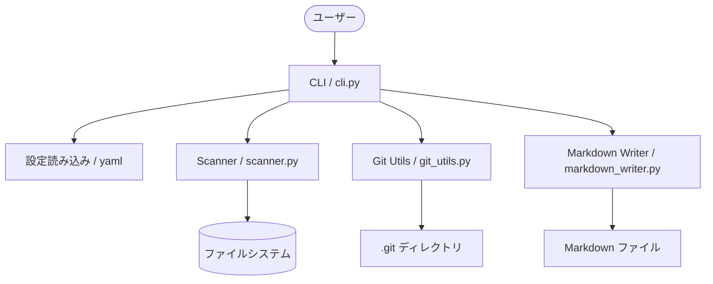
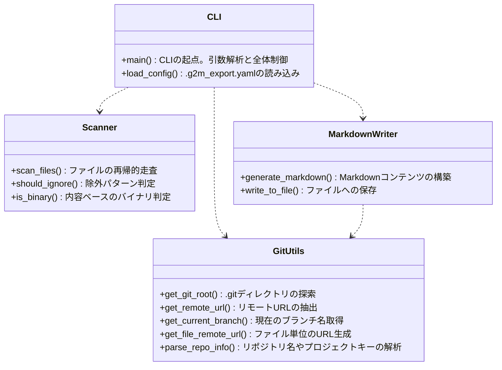
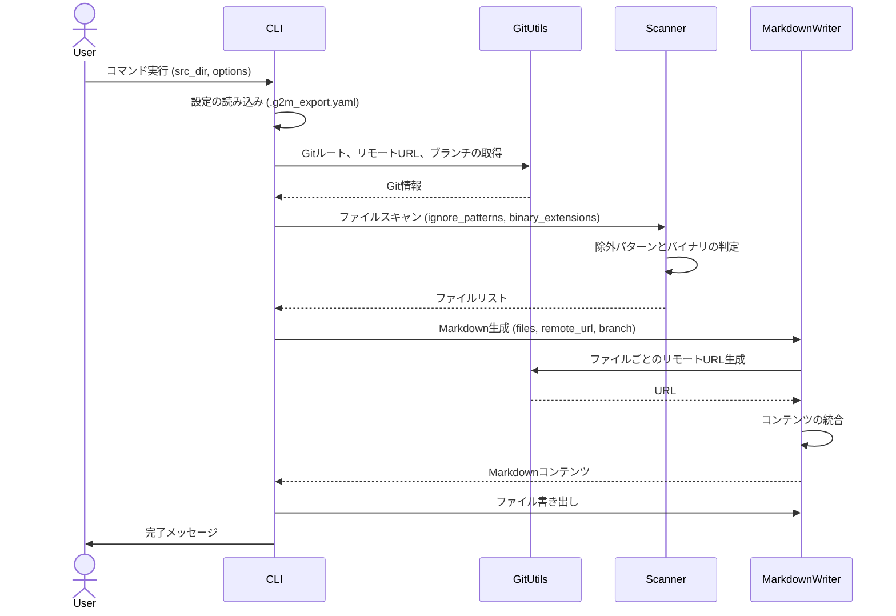
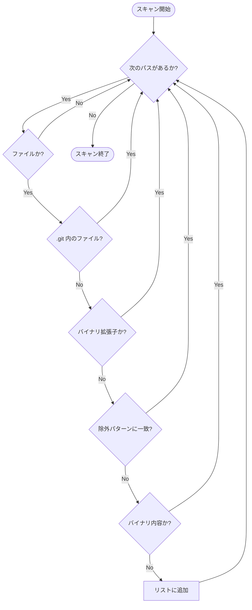

# G2M-Export 開発者向けドキュメント

このドキュメントは、G2M-Export の内部構造、アルゴリズム、および開発プロセスについて説明します。

## システム構成図

ツールの全体的なコンポーネント構成とデータの流れを以下に示します。



## クラス/モジュール構造

主なモジュールとその役割は以下の通りです。



## 処理シーケンス

CLI を実行してから Markdown ファイルが出力されるまでの流れです。



## ファイルスキャン・アルゴリズム

ファイルのスキャンとフィルタリングのプロセスです。バイナリ判定は拡張子と内容の両面で行われます。



## テスト方法

品質管理のために、pytest を使用した自動テストを実施しています。

### テストの実行

開発用依存関係をインストールした後、プロジェクトルートで以下のコマンドを実行します。

```bash
# 依存関係のインストール
pip install -r requirements-dev.txt

# テストの実行
PYTHONPATH=. pytest tests/
```

### テスト構成

- `tests/test_git_utils.py`: Git情報の取得やURLパースのロジックをテストします。
- `tests/test_scanner.py`: ファイルのフィルタリング、除外パターン、バイナリ判定をテストします。

### カバレッジの確認 (任意)

`pytest-cov` を使用してカバレッジを確認できます。

```bash
pip install pytest-cov
PYTHONPATH=. pytest --cov=g2m_export tests/
```

## コーディング規約

- Python 3.8 以上を対象とします。
- `pre-commit` を使用して、コミット前に `ruff` による Lint/Format や型チェック（将来導入予定）が行われるように設定されています。
- コメントやドキュメントは日本語で記載します。
